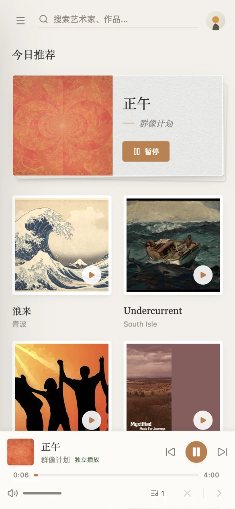
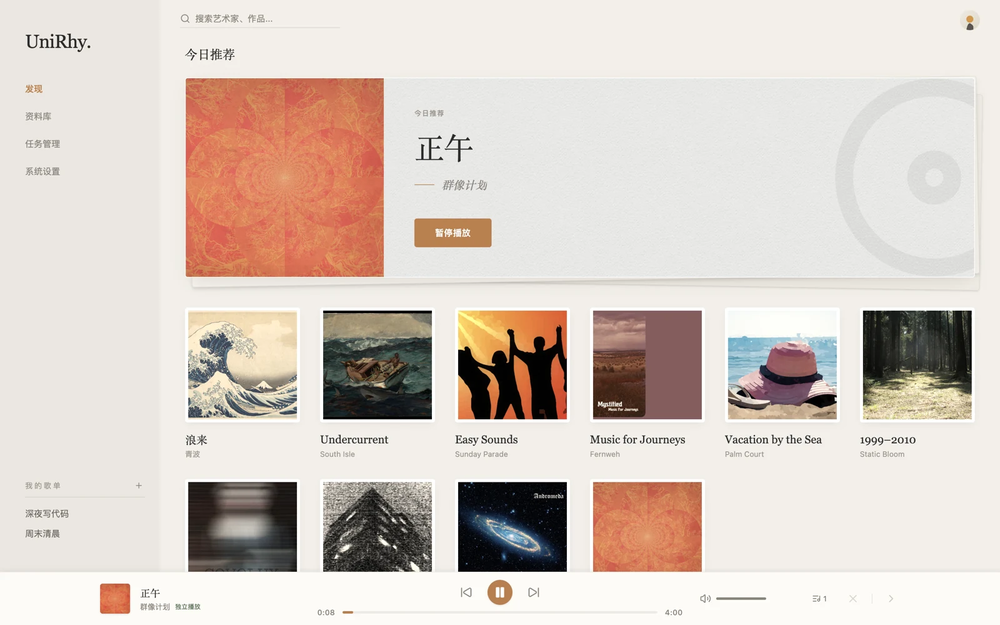

#  UniRhy

UniRhy（独一律）是一个私有化的音乐流媒体平台，采用 monorepo 组织前后端与官网工程。项目目标是提供可自部署、可扩展的音乐库管理、播放与同步能力。

[English](../README.md) | 简体中文

> [!NOTE]
> 项目仍处于极早期阶段，我们欢迎各种形式的反馈与贡献。不排除对现有功能进行大规模调整的可能。

## 界面预览

<table align="center">
  <tr>
    <td></td>
    <td></td>
  </tr>
</table>

<sub>截图中的专辑封面均为公有领域素材（CC0 / Public Domain Mark，来自 The Met Open Access 与 Internet Archive netlabels），专辑、艺术家与曲目名称均为虚构演示数据。</sub>

## 功能特性

- 私有化部署，无外部依赖。
- 音乐资源管理。
- 全平台客户端，覆盖 Web、macOS、Android、iOS 与 Windows。
- 播放状态同步。
- 插件化扩展。

## 项目结构

- `server/`：后端服务，基于 Spring Boot、Kotlin、Gradle 与 Jimmer ORM。
- `web/`：主前端客户端，基于 Vue、TypeScript、Vite、Pinia 与 Tailwind CSS，并包含 Tauri 2 桌面端配置。
- `website/`：项目官网，基于 Vue、TypeScript 与 Vite。
- `docker/`：容器化部署相关文件。
- `docs/`：项目级补充文档，发行说明位于 `docs/release_notes/`。
- `skills/`：开发辅助技能与领域约定文档。

## 环境要求

- JDK 25
- Node.js 24
- Yarn 4.12+
- PostgreSQL

## 快速开始

### 后端

```sh
cd server
./gradlew bootRun
```

### 前端客户端

```sh
cd web
yarn
yarn dev
```

### 官网

```sh
cd website
yarn
yarn dev
```

## 文档索引

- [术语规范词典（中英双语）](TERMINOLOGY.md)
- [后端测试约定](../server/README/TESTING.md)
- [播放同步协议](../server/README/PLAYBACK_SYNC_PROTOCOL.md)
- [播放同步计划](../server/README/PLAYBACK_SYNC_PLAN.md)
- [播放同步日志](../server/README/PLAYBACK_SYNC_LOGGING.md)
- [后端依赖说明](../server/README/DEPENDENCIES.md)
- [前端依赖说明](../web/README/DEPENDENCIES.md)

## 许可证

本项目许可证见 [LICENSE](../LICENSE)。
