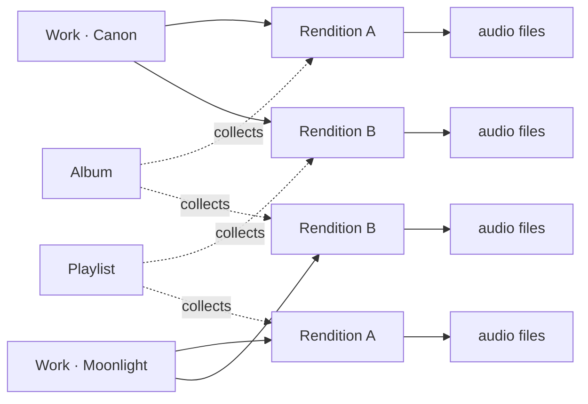

In a traditional player, one audio file is one song, and albums and playlists are simply collections of songs. UniRhy adjusts this model slightly — each song is organized in two layers: a **Work** and a **Rendition**.

## Work: the abstract piece

A **Work** is the abstract notion of a piece of music.

_Canon in D_ is a work. _Bohemian Rhapsody_ is a work. A film's theme song is a work. A work carries no duration, no performer and no audio file — it represents only the idea of the piece.

A playback request that names "Canon" refers to the work.

## Rendition: one concrete take of a work

A **Rendition** is one specific performance or recording of a work.

A single _Canon in D_ may exist as several renditions:

- Karajan with the Berlin Philharmonic, 1963
- Abbado live, 1989
- A chamber arrangement
- A solo guitar cover by an independent musician

All of them are _Canon_, yet they sound entirely different. In UniRhy they live as distinct **renditions** under the same **work**. Each rendition maintains its own artists, duration, cover and audio files.

When a playback request does not name a rendition, the system plays the rendition marked as the default; to play a specific one, select it from the work's detail page.

## Albums and playlists collect renditions

This is the most visible difference between UniRhy and most other players.

**Albums** and **playlists** do not collect abstract works. They collect **specific renditions**.

For example: adding a track to a playlist adds the exact rendition that was playing at that moment. Reopening the playlist later plays the same rendition — not another performance, and not another recording of it.

The behaviour sounds natural, yet most players cannot deliver it. When a pop song exists as a studio version, a cover, an acoustic and a live take, traditional libraries either treat them as four unrelated songs or jam them into one song's "alternate sources." UniRhy keeps them all under the same work while preserving each one's identity.

## Relationships at a glance

- A **work** holds many **renditions**;
- Each **rendition** holds one or more **audio files** (different formats or bitrates of the same performance — the client picks one based on network conditions);
- **Albums** and **playlists** are ordered collections of **renditions**.

## What this enables

### Multiple recordings of a classical work

For classical music, recordings of the same work by different conductors, ensembles and eras differ substantially and are the dimension listeners care about most. UniRhy groups them under a single work, enabling side-by-side browsing, comparison and independent inclusion in different playlists.

### Clean placement of covers and arrangements

Live, acoustic, remix and cover variants of a pop song no longer clutter search results as _Song Name (Live)_ / _Song Name (Remix)_. They coexist as renditions of one work, and the original take continues to appear as itself.

### Playlist stability

A playlist references the rendition, not the work. A rendition added today will remain the one played six months from now; it will not be silently replaced because a later import introduced a new recording sharing the same title.

## Behaviour during everyday use

- **During import**: UniRhy reads embedded metadata (title, artist, etc.) to determine the work a file belongs to and which rendition it is. Manual intervention is rarely required.
- **When metadata is inaccurate**: if recordings of a single work are split across separate works, or unrelated tracks are merged into one, the grouping can be corrected from the admin UI.
- **Multiple files per rendition**: the original lossless file and its Opus transcodes are automatically attached to the same rendition; the client picks an appropriate one for playback without surfacing the detail.

In day-to-day use the visible concepts are mainly Albums, Playlists, Artists and Works. The term Rendition appears mostly on the work detail page, yet it is the layer that ties the whole structure together.
