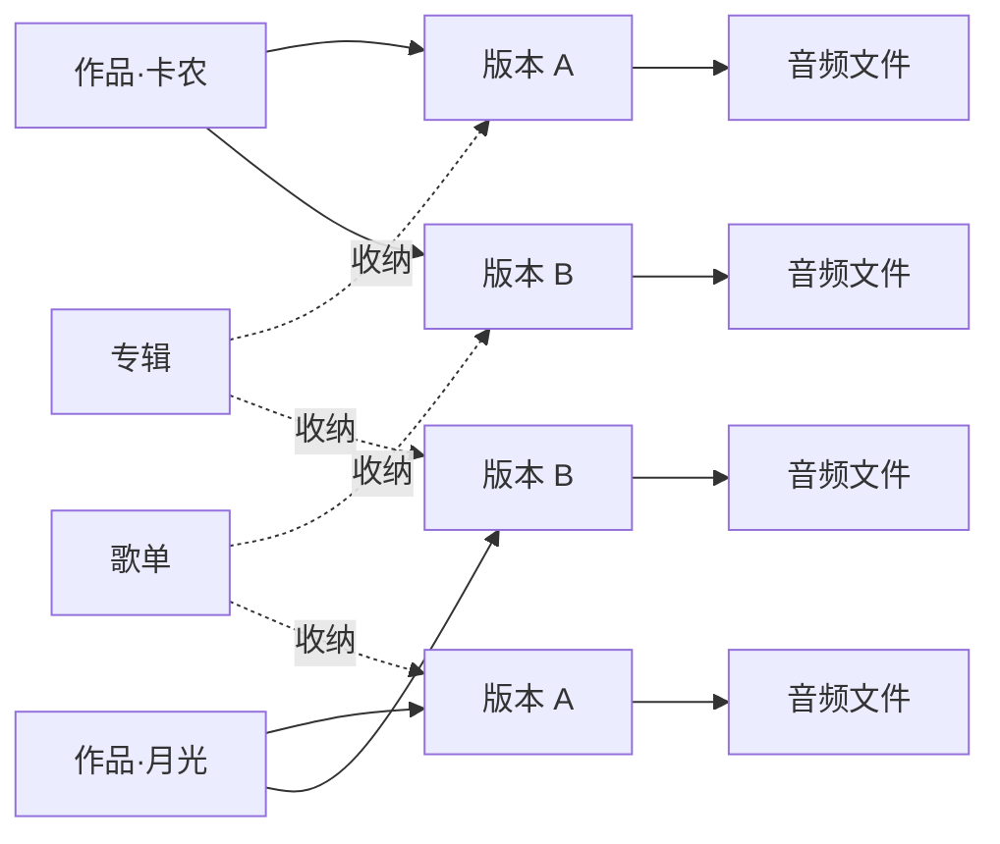

传统播放器里，一个音频文件即为一首歌，专辑与歌单都是若干首歌的集合。UniRhy 在这套模型上做了一处调整——同一首歌被拆成两层来组织：**作品**与**版本**。

## 作品：抽象的曲目

**作品**指的是一首乐曲本身的抽象概念。

《卡农》是一个作品。《Bohemian Rhapsody》是一个作品。某部电影的主题曲也是一个作品。作品本身不携带时长、演奏者或音频文件，它只是"这首曲子"这一概念。

在播放请求中提到的"卡农"，指的便是作品。

## 版本：作品的一次具体演绎

**版本**是一首作品的某一次具体演绎或录制。

同一首《卡农》可能存在多个版本：

- 1963 年卡拉扬指挥柏林爱乐的录音
- 1989 年阿巴多的现场
- 室内乐改编版
- 某位独立音乐人翻弹的吉他版

这些都属于《卡农》，但听感各不相同。在 UniRhy 中，它们是同一个**作品**下的不同**版本**。每个版本各自维护演奏者、时长、封面，并对应自己的音频文件。

若播放请求未指明版本，系统会按预先设置的"默认版本"播放；若需指定，可在作品详情页中选择。

## 专辑与歌单收纳的是版本

这是 UniRhy 与多数播放器最显著的区别。

**专辑**和**歌单**收纳的并非抽象作品，而是**具体的版本**。

举例而言：将一首曲目加入歌单时，加入的是当时正在播放的那一个版本；后续打开歌单，听到的仍是该版本——既不会替换为另一次演绎，也不会替换为另一份录音。

这一行为看似自然，但多数播放器并不具备。当一首流行歌存在原唱、翻唱、不插电与现场等多种版本时，传统库要么将其视为四首互不相关的歌，要么强行塞进同一首歌的不同"音源"。UniRhy 让它们归属于同一个作品，同时保留各自的独立身份。

## 关系示意图

- 一个**作品**下挂载多个**版本**；
- 每个**版本**下可挂载多份**音频文件**（同一版本的不同格式或码率，由客户端按网络条件自动选取）；
- **专辑**与**歌单**均为有序排列的**版本**集合。

## 该设计带来的能力

### 古典乐的多版本归并

对古典乐而言，同一部作品在不同指挥、不同乐团、不同年代下的录音差异显著，且为听众关注的核心维度。UniRhy 将其归入同一作品之下，便于浏览、对比，亦可分别加入不同的歌单。

### 翻唱与改编的清晰归属

流行乐中的 Live、Acoustic、Remix、Cover 不再以"歌名 (Live)""歌名 (Remix)"的形式分散在搜索结果中，而是以版本的身份共存于同一作品之下，原始版本仍以原本面貌呈现。

### 歌单内容的稳定性

歌单引用的是版本而非作品。某日加入歌单的演绎，半年后听到的仍是同一版本，不会因后续导入了同名的新录音而被悄然替换。

## 实际使用中的表现

- **导入音乐时**：UniRhy 根据音频文件中的元数据（曲名、艺术家等）自动判断其所属的作品与版本，多数情况下无需人工干预。
- **元数据不准时**：若同一作品的多份录音被错分至不同作品，或互不相关的曲目被错合并，可在管理界面手动调整。
- **同一版本多份文件**：原始无损文件与转码后的 Opus 文件会自动归入同一版本，客户端从中选取合适的一份用于播放，使用者无需关心底层细节。

日常使用中可见的概念主要是"专辑、歌单、艺术家、作品"几项；"版本"一词更多出现在作品详情页中，但正是这一层使整套结构得以贯通。
